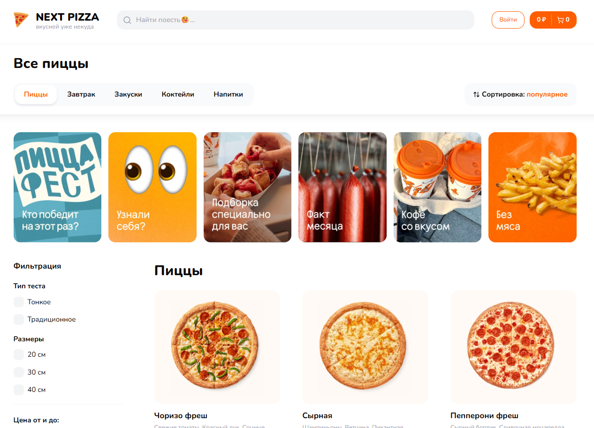
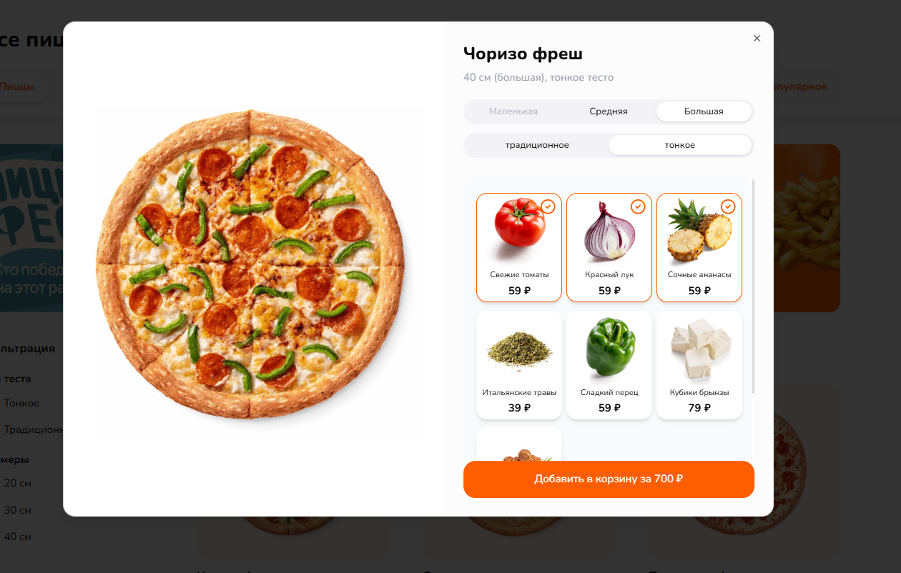

#  

## 

---

## 🍕 Project Overview

**Next Pizza** is a modern, full-featured pizza delivery web application inspired by popular online food delivery platforms.  
Built with **Next.js 15**, **React 19**, and **Tailwind CSS 4**, this app demonstrates real-world e‑commerce functionality, from **product filtering** to **custom pizza building**.

---

## 🚀 Live Demo

Check out the live project here: **[Next Pizza Live](https://next-pizza-phi-seven.vercel.app/)**

---

## ✨ Features

- 🔍 **Advanced Filtering** – Filter by dough type, size, and price in real-time  
- 🍕 **Custom Pizza Builder** – Select toppings and customize your pizza before checkout  
- 🛒 **Smart Cart System** – Real-time cart updates with toast notifications  
- 🔐 **User Authentication** – Secure login and account management using NextAuth  
- 💳 **Secure Checkout** – Integrated order flow with confirmation  
- 🔔 **Notifications** – Real-time feedback and alerts using `react-hot-toast`  
- 🎨 **Modern UI Components** – Built using Radix UI and TailwindCSS animations  

---

## 🛠 Tech Stack

- **Framework:** [Next.js 15](https://nextjs.org/) + [React 19](https://react.dev/)  
- **Styling:** [TailwindCSS 4](https://tailwindcss.com/) + `tailwind-merge` + `tailwindcss-animate`  
- **Forms:** [React Hook Form](https://react-hook-form.com/) + [Zod](https://zod.dev/) validation  
- **Database:** [Prisma ORM](https://www.prisma.io/) + PostgreSQL  
- **Authentication:** [NextAuth.js](https://next-auth.js.org/)  
- **State Management:** [Zustand](https://zustand-demo.pmnd.rs/)  
- **API & Requests:** [Axios](https://axios-http.com/)  
- **Icons & UI:** [Lucide React](https://lucide.dev/) + Radix UI  

---

## 📦 Installation & Setup

### 1. Clone Repository

```bash
git clone https://github.com/your-username/next-pizza.git
cd next-pizza 
```


### 2. Install Dependencies

```bash
npm install
echo "or"
yarn install
```

## 3. ⚙️ Configure Environment Variables

Create **.env.local** in the root directory:

```
# Database
POSTGRES_URL="your_postgres_connection_string"
POSTGRES_URL_NON_POOLING="your_postgres_non_pooling_string"

# Authentication
NEXTAUTH_SECRET="your_nextauth_secret"
NEXT_PUBLIC_API_URL="http://localhost:3000"

# OAuth Providers
GITHUB_ID="your_github_oauth_id"
GITHUB_SECRET="your_github_oauth_secret"
GOOGLE_CLIENT_ID="your_google_oauth_id"
GOOGLE_CLIENT_SECRET="your_google_oauth_secret"

# Email Service
RESEND_API_KEY="your_resend_api_key"
```

## 4. Database Setup

```bash
npx prisma generate
npx prisma db push
npx prisma db seed
```


## 5. Run Development Server

```bash
npm run dev
```

## 📁 Project Structure

```plaintext
next-pizza/
├── app/                # Next.js App Router
│   ├── (pizza)/        # Pizza pages
│   ├── (checkout)/     # Checkout process
│   ├── api/            # API routes
│   └── globals.css     # Global styles
├── components/         # UI components
├── prisma/             # Database schema & migrations
├── public/             # Static assets
├── hooks/              # Custom hooks
├── lib/                # Utilities & configs
└── tsconfig.json       # TypeScript configuration
```


## 🔧 Development

### Generate Prisma Client
```bash
npx prisma generate
```

### Push Schema Changes
```bash
npx prisma db push
```
### View database in Prisma Studio
npx prisma studio

### Reset database
npx prisma db reset

## 🏗️ Building for Production
npm run build
npm start

---

## 🚀 Deployment

The application is deployed on **Vercel** with the following setup:

- **Database:** PostgreSQL hosted on Vercel Postgres
- **Environment Variables:** Configured in Vercel dashboard
- **Automatic Deployments:** Connected to GitHub for CI/CD

### Deploy to Vercel

1. Push your code to GitHub
2. Connect your repository to Vercel
3. Configure environment variables in Vercel dashboard
4. Deploy automatically on every push to main branch

---

## 🤝 Contributing

Contributions are welcome! Please feel free to submit a Pull Request.

1. Fork the project
2. Create your feature branch (`git checkout -b feature/AmazingFeature`)
3. Commit your changes (`git commit -m 'Add some AmazingFeature'`)
4. Push to the branch (`git push origin feature/AmazingFeature`)
5. Open a Pull Request

---

## 📝 Recent Updates

- ✅ Implemented server-side filtering with URL-based state management  
- ✅ Developed a full-featured cart and checkout workflow  
- ✅ Added support for multiple authentication providers (GitHub, Google)  
- ✅ Enabled email verification and notification features  
- ✅ Built a user profile management dashboard  
- ✅ Integrated modal views and parallel routing for product details  
- ✅ Configured PostgreSQL database using Prisma ORM  
- ✅ Successfully deployed to Vercel with automated CI/CD pipelines


---

## 🙏 Acknowledgments

- Inspired by [DodoPizza](https://dodopizza.pl/) for the design and functionality
- Thanks to the Next.js team for the amazing framework
- Vercel for providing excellent hosting and database services
- The open-source community for the incredible tools and libraries

---

## ⭐ Enjoying the project? A ⭐ would be much appreciated!